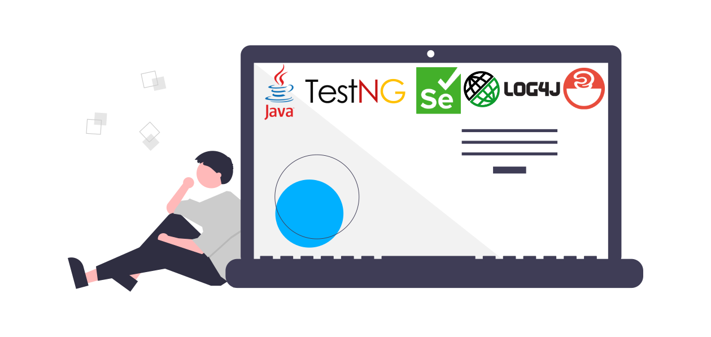

Different applications and software require different solutions for automated testing. However, many of these frameworks require most of the same base components.

As such, I've decided to create this **Test Automation Framework Skeleton** project. I've detailed exactly [how I created this project and how to use it on my blog](https://andreidobra.com/blog/full-stack-test-automation-framework-skeleton). For more automation tips, tricks, and videos, check out my personal website: https://andreidobra.com

---

### About the repo
Using Maven, it includes four main dependencies with their latest versions:
- TestNG: for a simple yet powerful test running experience
- Selenium: for browser-based front-end UI-focused tests
- RestAssured: for backend API-focused tests
- SLF4J with Log4j2: for logging and log management

Also using Maven, two plugins configured for a distinct testing experience:
- Surefire: the default unit testing plugin that is configured to run all classes that end in `ApiTests`
- Failsafe: the integration testing plugin that is configured to run all classes that end in `UiTests`

Additional "_nice to have_" features of this project:
- Latest version of Selenium included, which requires no extra configuration for external files like `chromedriver`
- `src/test/resources/log4j2.properties` file that formats the text printed out to the console and saves a log file to the `target/logs` folder
- Maven Failsafe plugin also generates a set of test reports at the end of execution in different formats: HTML & XML.
- `.gitignore` configured for Java projects
- `intellij-java-google-style.xml` to provide a custom code style formatter via IntelliJ.
---

### Using it

Prerequisites:
- Java JDK 17 installed
- Apache Maven installed
- Google Chrome installed. If you use other browsers, you will need to modify the webdriver instantiated in `src/test/java/com/andreidobra/FrontEndUiTests.java`
- optional: IntelliJ Community Edition installed

Running the tests:
- `mvn test` will run the Surefire plugin and execute all tests that are in classes that end in `ApiTests`. No UI tests will be executed.
- `mvn verify` will run the Failsafe plugin and execute all the API tests, just like `mvn test` as well as all the UI tests which are included in classes that end in `UiTests`.

Why is this separation in place? Ideally you want unit tests to be under the `test` command. These should be fast, reliable, and if they break, they should stop everything.

You also want integration tests or those that rely on more dependencies (such as a web browser) to be under the `integration-test` or `verify` commands. These can take longer to execute and, if they break, their failure should just be added to the test report at the end of the whole test suite execution.

If you don't agree with this, modify the plugins inside the `pom.xml` file to suit your own preferences.

---
Feel free to fork this repo or use it as your base for your framework. For more automation tips, tricks, and videos, check out my personal website: https://andreidobra.com

Header image originally from [Undraw](https://undraw.co/), modified by me.